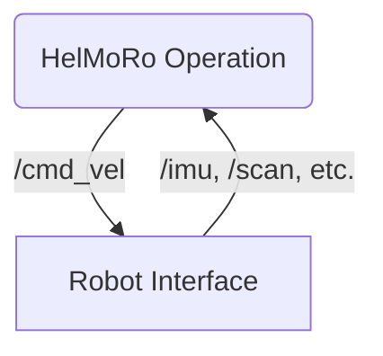

# HelMoRo-software-ROS2

# Installation

The packages included support ROS Humble on Ubuntu 22.04.

1. Install [ROS Humble](https://docs.ros.org/en/humble/Installation/Ubuntu-Install-Debians.html) on Helmoro and on your local machine.

    Make sure you source ROS 2 every time you open a new Terminal using

      ```sh
      source /opt/ros/humble/setup.bash
      ```

    Alternatively you can add it to your .bashrc file

      ```sh
      echo "source /opt/ros/humble/setup.bash" >> ~/.bashrc
      ```

2. Create a [ROS2 Workspace](https://docs.ros.org/en/humble/Tutorials/Beginner-Client-Libraries/Creating-A-Workspace/Creating-A-Workspace.html)

      ```sh
      mkdir -p ~/ros2_ws/src
      cd ~/ros2_ws/src
      ```

3. Clone the repository into your catkin workspace. The commands are stated in the following.

      ```sh
      git clone https://github.com/Helbling-Technik/HelMoRo-software-ROS2.git
      ```

4. Clone repositories for sensors

      ```sh
      git clone https://github.com/flynneva/bno055.git
      git clone -b ros2 https://github.com/Slamtec/rplidar_ros.git
      ```

5. Install the ROS 2 dependencies

      ```sh
      cd ~/ros2_ws
      sudo apt-get update
      rosdep install --from-path src -yi
      ```

6. Build and source the Helmoro software package using

      ```sh
      colcon build --symlink-install
      source install/local_setup.bash
      ```

6. Run the Simulation

      ```sh
      ros2 launch helmoro_sim_bringup gazebo_sim_launch.py
      ```

## Software Structure

For the upgraded HelMoRo package the [Create 3 repository](https://github.com/iRobotEducation/create3_sim) as well as the [ROS 1 repository of HelMoRo](https://github.com/Helbling-Technik/HelMoRo-software) served as inspiration. Similar to the Create 3 repository the software is split into 2 packages. Namely the **HelMoRo Base Package** and the **HelMoRo Operations Package**. The first package is used to build a clean robot interface both in simulation and on the real robot. The interface is the same for both cases. It consists of all the sensor topics and it provides a '/cmd_vel' topic for different operation packages to be used. The HelMoRo Operations Package currently only houses one operation package. In the future a navigation package and an exploration package can be added.



The HelMoRo Base Package is split further into a common, a simulation and real package. In the common package are all the ROS packages which are used both in simulation and on the real robot. The helmoro_sim and the helmoro_real folder house all the respactive ROS packages that are needed for simulation or for the real robot.

## Current Status

The latest commit should be approached with caution as it contains all the latest **UNTESTED** changes I've made. For initial setup try [this commit](https://github.com/Helbling-Technik/HelMoRo-software-ROS2/commit/c1cb2c720e1bdec3961e382ec64126186c90d3a6) first. 

### Simulation

The simulation is setup with gazebo harmonic and you should be able to drive the robot using a logitech game controllers. To do so you will need to start the joy node using

```sh
ros2 launch helmoro_joy_control joy_control_launch.py
```

and the simulation using the command stated above. The ros packages helmoro_slam and helmoro_state_estimation are two packages with work in progress and need to be further implemented so the navigation stack can be run both in simulation and on the real robot.

### Real Robot

Both for the lidar and the imu working ros2 packages were found and they have been tested on the real hardware. The motor controllers were freshly setup and the helmoro_motors package has been updated and ported to ROS 2 & python. The helmoro_motor package needs further testing with the real system however. I was able to drive the robot with the newly implemented motor package, but I feel that the internal PID needs some fresh tuning or there might be some other Issues. During my testing the robot tended to very aggressive movements.

To drive the robot in the current state you will need to connect to the raspberry pi via ssh and launch the following command on the real system:

```sh
ros2 launch helmoro_real_bringup helmoro_launch.py
```

On the host computer start the helmoro joy control node with the command above and you should now be able to control the robot using the game controller. 
